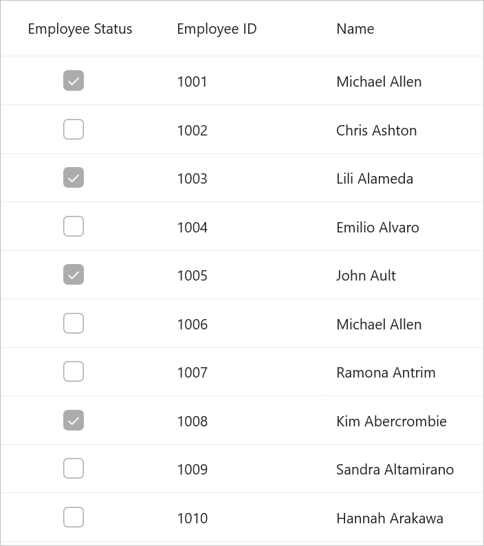

# How to make a check box column read only in .NET MAUI DataGrid SfDataGrid
Currently, [SfDataGrid](https://www.syncfusion.com/maui-controls/maui-datagrid) does not offer built-in support for setting a [DataGridCheckBoxColumn](https://help.syncfusion.com/cr/maui/Syncfusion.Maui.DataGrid.DataGridCheckBoxColumn.html) as read-only. However, you can fulfill this requirement by incorporating a CheckBox within a `DataGridTemplateColumn` and configuring the `IsEnabled` property of the CheckBox to be `false`.

##### xaml:
 ```XML
<syncfusion:SfDataGrid  ItemsSource="{Binding Employees}"
                        AutoGenerateColumnsMode="None"                  
                        DefaultColumnWidth="155">
    <syncfusion:SfDataGrid.Columns>
        <syncfusion:DataGridTemplateColumn MappingName="EmployeeStatus"                                               
                                           HeaderText="Employee Status">
            <syncfusion:DataGridTemplateColumn.CellTemplate>
                <DataTemplate>
                    <CheckBox IsEnabled="False"
                              HorizontalOptions="Center"
                              IsChecked="{Binding EmployeeStatus}" />
                </DataTemplate>
            </syncfusion:DataGridTemplateColumn.CellTemplate>
        </syncfusion:DataGridTemplateColumn>
        <syncfusion:DataGridTextColumn MappingName="EmployeeID"
                                       HeaderText="Employee ID" />
        <syncfusion:DataGridTextColumn MappingName="Name"
                                       HeaderText="Name" />
        <syncfusion:DataGridTextColumn MappingName="IDNumber"
                                       HeaderText="ID Number" />
    </syncfusion:SfDataGrid.Columns>

</syncfusion:SfDataGrid>
 ```
 
Executing the code example above yields the following output.



[View sample in GitHub](https://github.com/SyncfusionExamples/How-to-make-a-check-box-column-read-only-in-.NET-MAUI-DataGrid-SfDataGrid/tree/master)

Take a moment to explore this [documentation](https://help.syncfusion.com/maui/datagrid/overview), where you can find more information about Syncfusion .NET MAUI DataGrid (SfDataGrid) with code examples. Please refer to this [link](https://www.syncfusion.com/maui-controls/maui-datagrid) to learn about the essential features of Syncfusion .NET MAUI DataGrid (SfDataGrid).

##### Conclusion

I hope you enjoyed learning about how to make a check box column read-only in .NET MAUI DataGrid (SfDataGrid)?

You can refer to our [.NET MAUI DataGrid’s feature tour](https://www.syncfusion.com/maui-controls/maui-datagrid) page to learn about its other groundbreaking feature representations. You can also explore our [.NET MAUI DataGrid Documentation](https://help.syncfusion.com/maui/datagrid/getting-started) to understand how to present and manipulate data. 
For current customers, you can check out our .NET MAUI components on the [License and Downloads](https://www.syncfusion.com/sales/teamlicense) page. If you are new to Syncfusion, you can try our 30-day [free trial](https://www.syncfusion.com/downloads/maui) to explore our .NET MAUI DataGrid and other .NET MAUI components. 

If you have any queries or require clarifications, please let us know in the comments below. You can also contact us through our [support forums](https://www.syncfusion.com/forums), [Direct-Trac](https://support.syncfusion.com/create) or [feedback portal](https://www.syncfusion.com/feedback/maui?control=sfdatagrid), or the feedback portal. We are always happy to assist you!

